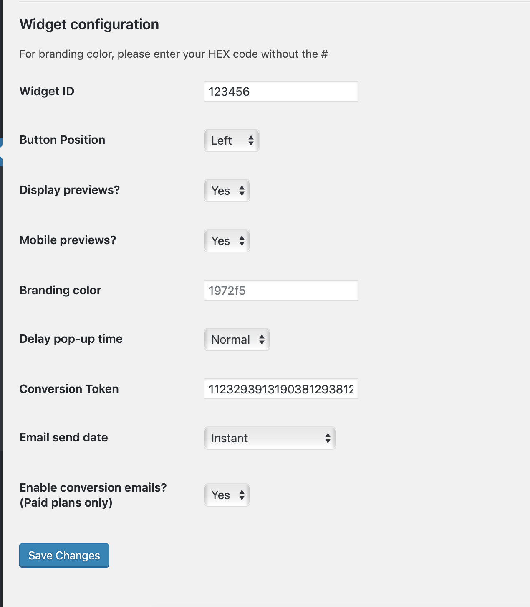
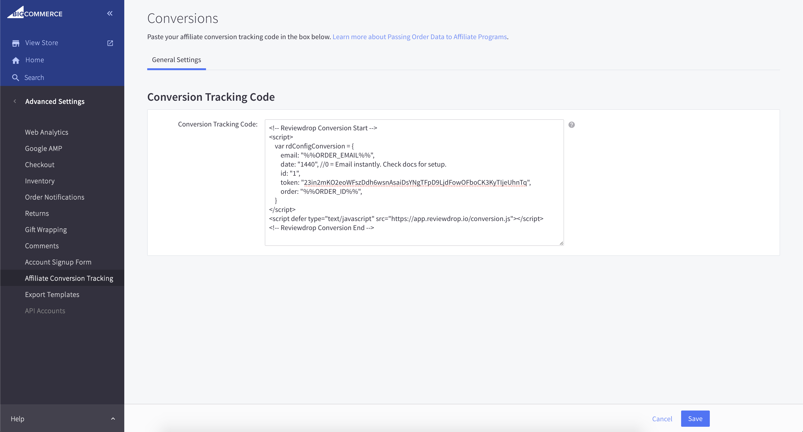

# Automatic invite emails

To automate the process of collecting reviews on your online store, we have created a simple conversion script that will send email invitations to the customer at a selected date after order.

### Woocommerce

To install our script on Woocommerce, first download the plugin from the WordPress plugin marketplace. Alternatively, download [here](https://wordpress.org/plugins/reviewdrop/).

To install our plugin with WordPress, please navigate to your admin dashboard:

1. Login to your WordPress admin dashboard.


2. Head to **Plugins -&gt; Add new**

3. Search for Reviewdrop or download the plugin [here](https://wordpress.org/plugins/reviewdrop/).

4. Install and activate the plugin and head to the settings page to configure.

5. Navigate back to your Reviewdrop dashboard -&gt; [**Widget page**](https://reviewdrop.io/embed).

6. Copy your ID found under - **Your ID for third party plugins is: 103233**

7. Paste the ID on the Reviewdrop WordPress settings plugin. Found at **WP Admin -&gt;** **Settings -&gt; Reviewdrop**.

8. Next, head back to your Reviewdrop dashboard then [**Manage account -&gt; Settings -&gt; API**](https://reviewdrop.io/settings#/api)\*\*\*\*

9. Enter a name for the token \(Website name\) and click create. Copy your access token \(Note: this will only appear once\) and navigate back to the WordPress plugin page to paste under 'Conversion Token'.

10. Set the email send date and make sure 'Enable conversion emails' is on. 

11. Hit 'Save changes' and you should be ready to test an order. Once you reach the 'Order complete' page you should recieve an email invite from the order email you used.



### Bigcommerce

To install our script on Bigcommerce, first navigate to the [**Marketing -&gt; Settings**](https://reviewdrop.io/customers/settings) ****page on your dashboard. 

```markup
<!-- Reviewdrop Conversion Start Bigcommerce -->
<script>
    var rdConfigConversion = {
        email: "%%ORDER_EMAIL%%",
        date: "1440", //1440 = Email 1 day after order. Check docs for setup.
        id: "YOUR REVIEWDROP ID",
        token: "ENTER TOKEN HERE",
        order: "%%ORDER_ID%%",
    }
</script>
<script defer type="text/javascript" src="https://app.reviewdrop.io/conversion.js"></script>
<!-- Reviewdrop Conversion End Bigcommerce -->
```

1. Copy the script code to your clipboard and head to your Bigcommerce dashboard.
2. Click **Advanced Settings -&gt; Affiliate Conversion Tracking** and paste your code.
3. Next, head back to your Reviewdrop dashboard then [**Manage account -&gt; Settings -&gt; API**](https://reviewdrop.io/settings#/api)
4. Enter a name for the token \(Website name\) and click create. Copy your access token \(Note: this will only appear once\) and navigate back to the Bigcommerce dashboard to paste under inside the _**token: "INSERT CODE HERE"**_ quotes.
5. As seen in the image below, we are using Bigcommerce global variable %%ORDER\_EMAIL%% and %%ORDER\_ID%% to track what email we should send the invite to. These are required to function properly.
6. The **date** paramter allows you to choose when the email should be sent from order placement. We use time in seconds here which can be confusing at first. Please use the table below to configure correctly. By default time is set to 0 which will send instantly after order.
7. Hit save, and try out a test order to ensure you recieve an email. You may recieve an error about order data but continue as it's not needed for our case.



| Time \(seconds\) | Email send date |
| :--- | :--- |
| 0 | Instantly |
| 1440 | 1 day after order |
| 2880 | 2 days after order |
| 4320 | 3 days after order |
| 10080 | 1 week after order |
| 20160 | 2 weeks after order |
| 30240 | 3 weeks after order |
| 40320 | 4 weeks after order |

### Shopify

1. To install our script on Shopify, first navigate to the [**Marketing -&gt; Settings**](https://reviewdrop.io/customers/settings) ****page on your reviewdrop dashboard. Copy the code there or use the code snippet below. Make note of your Reviewdrop ID found on the marketing -&gt; settings page.



```markup
<!-- Reviewdrop Conversion Start Shopify -->
<script>
    var rdConfigConversion = {
        email: "{{ order.email }}",
        date: "1440", //1440 = Email 1 day after order. Check docs for setup.
        id: "YOUR REVIEWDROP ID",
        token: "ENTER TOKEN HERE",
        order: "{{ order.id }}",
    }
</script>
<script defer type="text/javascript" src="https://app.reviewdrop.io/conversion.js"></script>
<!-- Reviewdrop Conversion End Shopify -->
```



1. 2. On Shopify, navigate to your store admin page and go to **Settings -&gt; Checkout** and scroll to **Order Processing -&gt; Additional Scripts** then paste your code. ****
3. Next, head back to your Reviewdrop dashboard then [**Manage account -&gt; Settings -&gt; API**](https://reviewdrop.io/settings#/api)
4. Enter a name for the token \(Website name\) and click create. Copy your access token \(Note: this will only appear once\) and navigate back to the Bigcommerce dashboard to paste under inside the _**token: "INSERT CODE HERE"**_ quotes.
5. As seen in the image below, we are using Bigcommerce global variable {{ order.email }} and {{ order.id }} to track what email we should send the invite to. These are required to function properly.
6. The **date** paramter allows you to choose when the email should be sent from order placement. We use time in seconds here which can be confusing at first. Please use the table below to configure correctly. By default time is set to 0 which will send instantly after order.
7. Hit save, and try out a test order to ensure you recieve an email.
8.   | Time \(seconds\) | Email send date |
   | :--- | :--- |
   | 0 | Instantly |
   | 1440 | 1 day after order |
   | 2880 | 2 days after order |
   | 4320 | 3 days after order |
   | 10080 | 1 week after order |
   | 20160 | 2 weeks after order |
   | 30240 | 3 weeks after order |
   | 40320 | 4 weeks after order |


