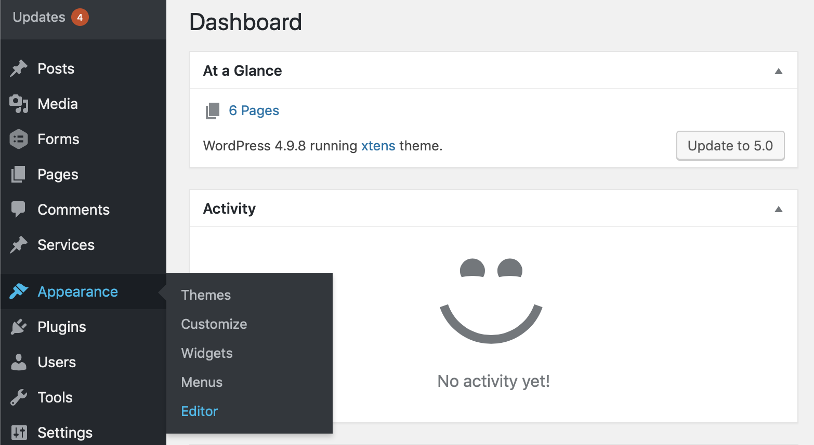

# Automatic invite emails

To automate the process of collecting reviews on your online store, we have created a simple conversion script that will send email invitations to the customer at a selected date after order.

### Woocommerce

To install our script on Woocommerce, first download the plugin from the WordPress plugin marketplace. Alternatively, download [here](https://wordpress.org/plugins/reviewdrop/).

To install our plugin with WordPress, please navigate to your admin dashboard:

1. Login to your WordPress admin dashboard.

2. Head to **Plugins -&gt; Add new**

3. Search for Reviewdrop or download the plugin [here](https://wordpress.org/plugins/reviewdrop/).

4. Install and activate the plugin and head to the settings page to configure.

5. Navigate back to your Reviewdrop dashboard -&gt; [**Widget page**](https://reviewdrop.io/embed).

6. Copy your ID found under - **Your ID for third party plugins is: 103233**

7. Paste the ID on the Reviewdrop WordPress settings plugin. Found at **WP Admin -&gt;** **Settings -&gt; Reviewdrop**.

8. Next, head back to your Reviewdrop dashboard then [**Manage account -&gt; Settings -&gt; API**](https://reviewdrop.io/settings#/api)\*\*\*\*

9. Enter a name for the token \(Website name\) and click create. Copy your access token \(Note: this will only appear once\) and navigate back to the WordPress plugin page to paste under 'Conversion Token'.

10. Set the email send date and make sure 'Enable conversion emails' is on. 

11. Hit 'Save changes' and you should be ready to test an order. Once you reach the 'Order complete' page you should recieve an email invite from the order email you used.

1. 
