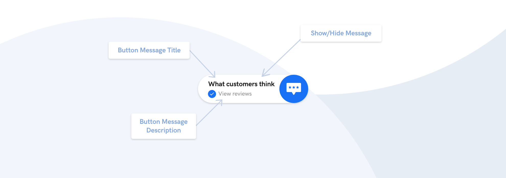
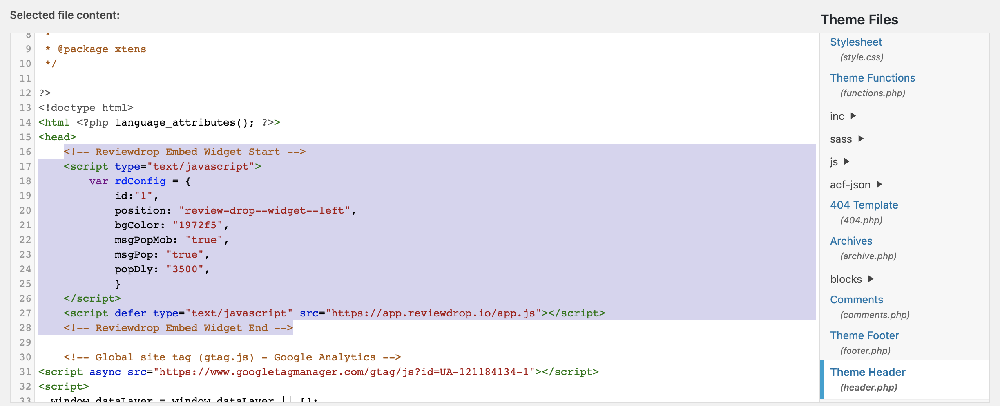
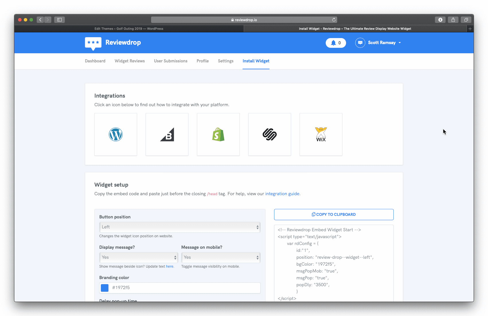
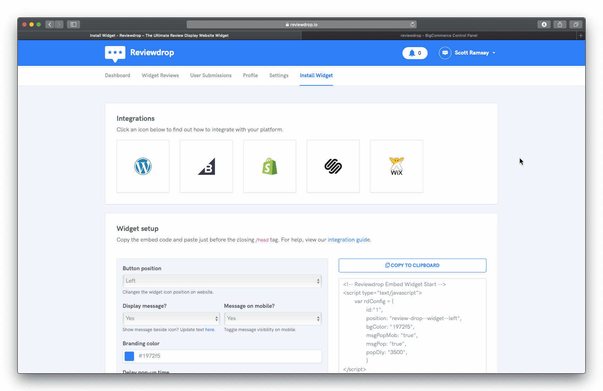
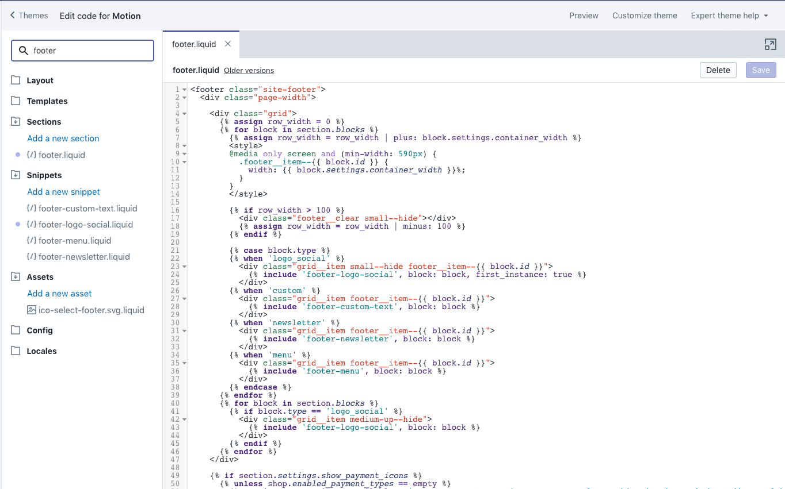
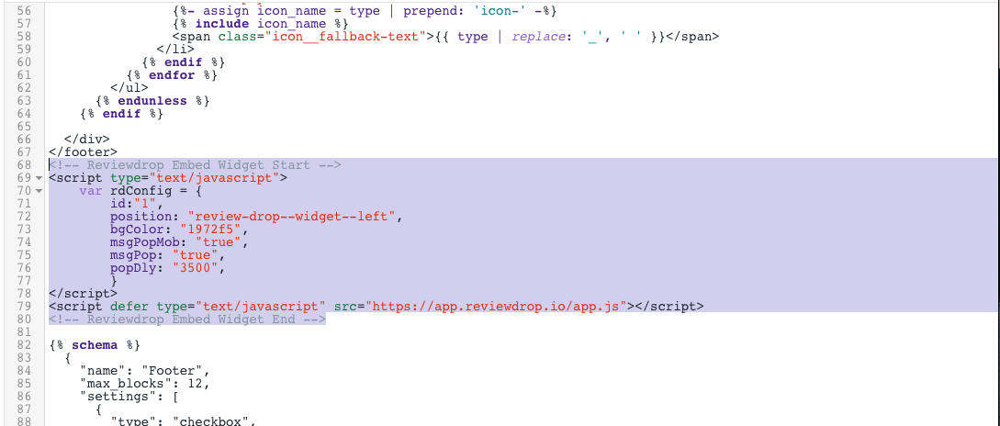

# Install Widget on Your Website

## Widget builder

For ease of use, please use our [widget builder](https://reviewdrop.io/embed) from your dashboard.

| Option | Values |
| :--- | :--- |
| **Button Position** - Either bottom left or right if using chat widget. | Left/Right |
| **Display Message** - Ability to hide button message completely. | Yes/No |
| **Message on mobile?** - Ability to hide button message on mobile. | Yes/No |
| **Branding Color** - \(Experimental: Changes top header area on widget.\) | HEX |
| **Delay Pop-Up Time** - Change duration before button appears on site. | Normal/Fast/Long |

After you have selected your desired customizations, click "Create Widget" and copy the code to your clipboard.

## Standard

The Reviewdrop widget has been designed to work virtually anywhere. Just paste in the script code just before the **&lt;/head&gt;** closing tag on your site. Many website builders/cms tools have header script management built in. 

## WordPress

To install the widget with WordPress, please navigate to your theme **header.php** file.

1. Login to your WordPress admin dashboard.

2. Head to **Appearance -&gt; Editor**

3. Find the **header.php** file on the right sidebar. Please note that this may vary depending on your theme.

4. At the end of your &lt;head&gt; tag, paste in the embed code found on the [Install Widget](https://reviewdrop.io/embed) page.

5. Hit **Update File** and you should be good to go!

## Squarespace

## BigCommerce

We are working on adding an app to the BigCommerce store. In the meantime you can navigate to:


Bigcommerce Dashboard -&gt; Storefront -&gt; Footer Scripts


Paste in the embed code from the [builder](customise-widget-looks.md) and hit save.

## Shopify

To install the widget on Shopify we need to add the script to the footer. We will look at making this process easier through their app store in the future.

1. Navigate to your Shopify dashboard and click **Online Store -&gt; Themes**
2. Copy the embed code from Reviewdrop and head back to Shopify.

3. Click **Actions -&gt; Edit code** 

4. Search for **footer.liquid** on the editor sidebar. Please note: this may vary depending on the theme installed. Click on footer.liquid to open the file.

5. Search for the closing **&lt;/footer&gt;** tag and paste in the Reviewdrop embed code directly below it.

6. Hit save at the top right and you should be good to go!

## Wix

