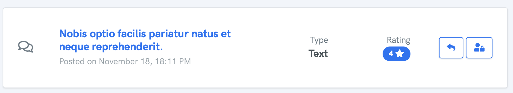

# Remove Reviews from Widget

To remove a review from the widget, navigate to the [Approved](https://reviewdrop.io/dashboard) page and either click into the desired review or search on the right sidebar.

### **Remove Publically Submitted Review**

To remove a review that was submitted and approved on the widget, find the desired review and click the **"User Locked"** icon on the right side, then click the **"Remove from Widget"** button.

