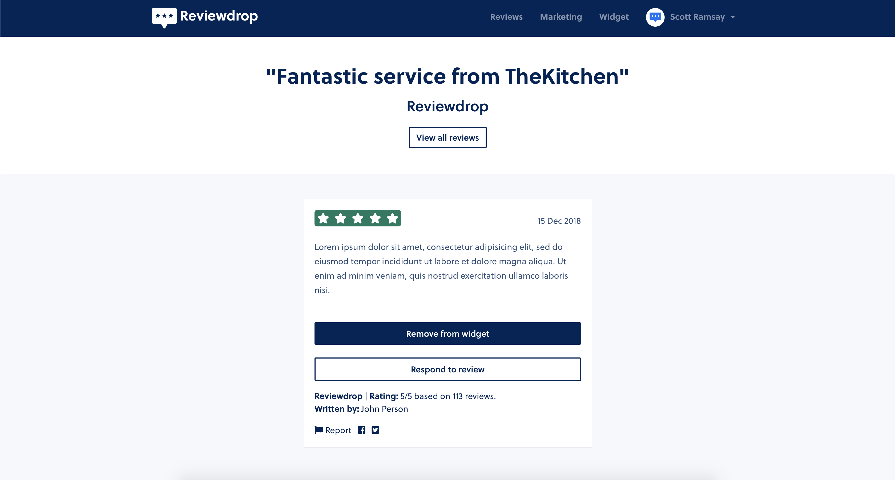

# Remove Reviews from Widget

To remove a review from the widget, navigate to the [Approved](https://reviewdrop.io/dashboard) page and either click into the desired review or search on the right sidebar.

### **Removing from Widget**

To remove a review that was submitted and approved on the widget, find the desired review and click into that review page. From here, you can click the **"Remove from widget"** button.


Reviews can be removed from your widget at any time but not your main profile page unless reported.


