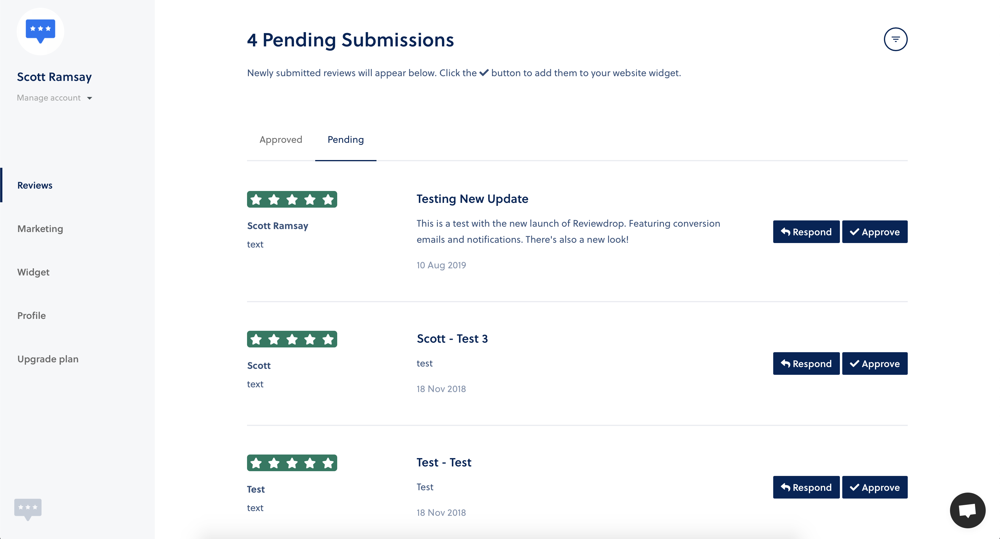

# Add Reviews to Widget

### Customer submitted

Customers are able to submit reviews which appear automatically on your profile page. Reviews submitted through this method still need to be manually approved to appear on the widget. The way we look at this is most busineses will only want to highlight positive reviews on their website and all reviews on your profile page.


Customer submitted reviews are available across **all plans**.


As an example, you can try our [submission page](https://reviewdrop.io/review/reviewdrop/submit). This can be found via your own profile page and then clicking the **"Write a Review"** button.

| Field | Description |
| :--- | :--- |
| **Rating** | Star rating. 5 possible stars. |
| **Title** | The reviewers name or business. |
| **Type** | Text/Image/Video |
|  **Name** | Add the name of the reviewer or business. |
| **Category** | What kind of business sector do they fall under - if any. |
| **Website URL** | A link to the business or shops website. |
| **Review Message** | The reviewers message. Must be over 30 characters. |

## Add Review to Widget

Now you understand how the review are collected, click into any review you wish to add to your widget. As long as you are logged in, you should see an **"Approve"** button appear. Click it and it should now appear on your widget.

