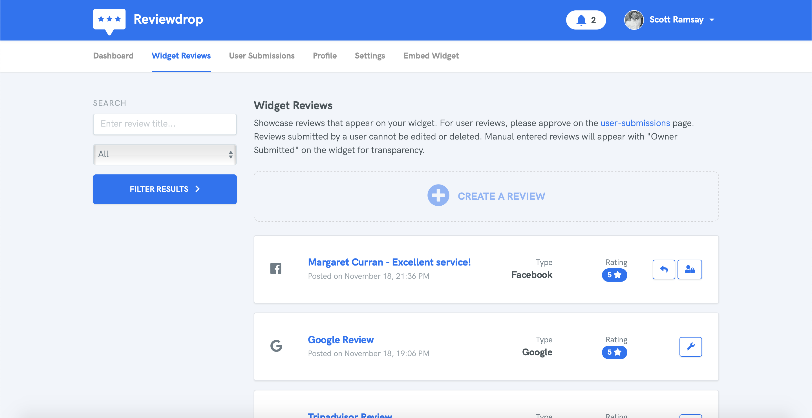
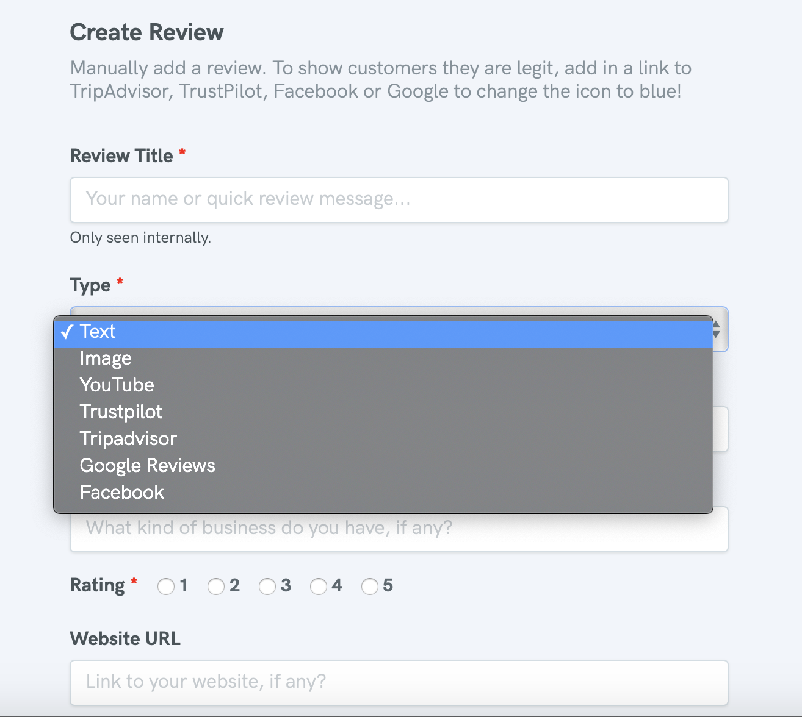

# Add Review

## Widget Reviews

Adding reviews to your widget is simple. Navigate to the [Widget Reviews](https://reviewdrop.io/dashboard) area and click "Create a Review". 



### Review Types

On the [Create Review](https://reviewdrop.io/reviews/create) screen you are able to manually add reviews customers have sent you via other mediums. 


Reviews that are manually entered will **always** appear with a notice that the review was "Externally Submitted" to improve customer transparency. 




#### Text

The text type allows you to add basic text. A link to the customers website, rating, name/business and message.

#### Image

The image type allows you to add basic text with the addition of an image. The image is a great method to provide rich content to visitors how they enjoyed using a product for example.

#### YouTube

To improve the review experience further, you can enter a YouTube URL that will embed into the review itself. You can also the same fields as the text field below it.

### 3rd Party Reviews

Ability to add 3rd party reviews is possible via the types below. Please note that reviews are not automatically aggregated from these services so you will still have to manually enter them. The trick here is to add a link to the 3rd party review where a notice appears saying "Verify on \[Trustpilot\]". 


Our goal here is to provide a level of authenticity that the review entered is backed up by the review on Google reviews for instance.


#### Trustpilot

Select the Trustpilot type and include a link to the same review. ****For example:

```text
https://uk.trustpilot.com/reviews/5bf282919d378009543cb2c3
```

#### Tripadvisor

Select the Tripadvisor type and include a link to the same review. For example:

```text
https://www.tripadvisor.co.uk/ShowUserReviews-g187514-d1948526-r630756238-Ferraz_apartment-Madrid.html
```

#### Google Reviews

Select the Google Reviews type and include a link to the same review. For example:

```text
https://www.google.co.uk/search?q=xtensive&oq=xtensive+&aqs=chrome..69i57j69i60l2j69i61j0l2.851j0j7&sourceid=chrome&ie=UTF-8#lrd=0x48884bf1d7f3223d:0x3ee94973b03ad90f,1,,,
```


Please note that Google doesn't make it easy to add individual reviews. We suggest linking to the main reviews page. Google chrome generates a URL when you open the star rating pop-up on your business card.


#### Facebook

Select the Facebook type and include a link to the same review. For example:

```text
https://en-gb.facebook.com/XtensiveLtd/reviews/?post_id=2150682771865952
```

