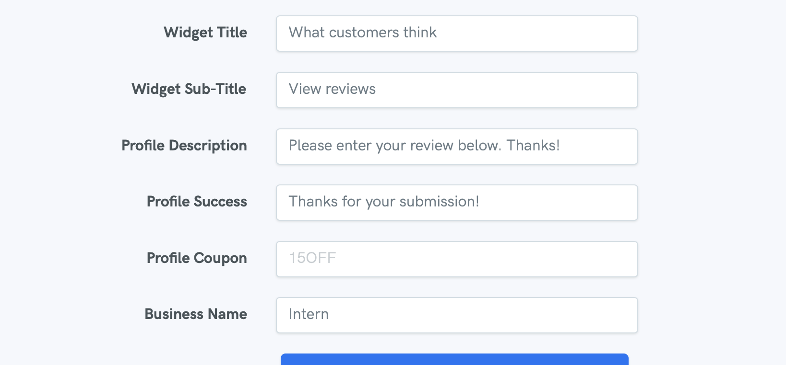

# Add Coupon after Submission

To add a coupon code that appears after a customer writes a review, head to settings -&gt; [profile](https://reviewdrop.io/settings#/profile) and scroll down until you get to "Profile Coupon". You can use a unique code generated from your e-commerce platform that only appears after a customer enters the review.

