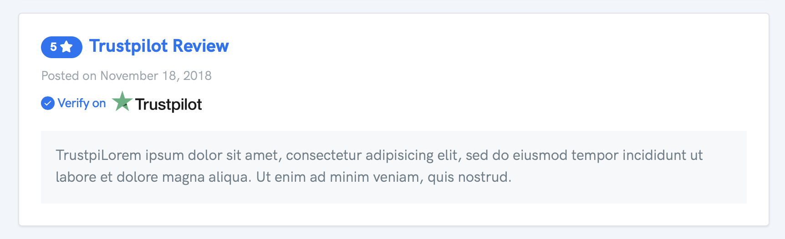

# Adding Reviews

## Customer Submitted Reviews

To recieve automatic reviews from your customers, you can make use of our profile page feature. We recommend using a third party link sharing service such as [http://bit.ly](http://bit.ly) to be able to track who clicked your link on newsletters/social media etc. You can either share your main profile page or copy the URL on the "Submit Review" page.

## Adding Customer Reviews

Customer reviews are a seperate entity from widget externally submitted reviews. This means that you cannot add/edit reviews from the customer submission form. Our goal is to increase transparency with both parties \(Business Owner/Visitor\) as who enjoys fake reviews? 

Any review submitted from your submit page will automatically appear on the main profile page. Reviews entered by you \(the business owner\) from the "Widget Reviews" area will also appear on this profile page, but will not count towards your total "Average Review". 

## Review Tagging

When a review is submitted on Reviewdrop you will notice a tag underneath the title. This is to let the visitor know if the review was either submitted from the public customer form or manually sourced by the owner on the customers behalf. The goal should always to be gaining customer reviews to improve your overall average rating.

#### Business Owner Externally Submitted

Text based reviews by the business owner will appear with an "Externally Submitted" tag, whereas a 3rd party manually entered review will appear with a "Verify on \[platform logo\]" tag. It is up to you as the owner to ensure both text reviews match on the external platform.

