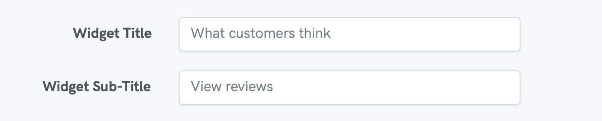
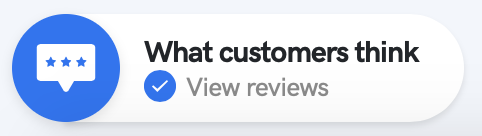

# Update Profile

## Updating Profile Username

We only recommend changing your username if you really have to. The reason being any links to reviews you have added over social media/email newsletters etc will 404 \(error\) as the profile URL changes.

To update the username please head to settings -&gt; [profile](https://reviewdrop.io/settings#/profile)


Changing your username will result in 404 \(Broken\) links from your previous username url. Use at your own risk!


## Updating Widget Icon Message

To update the message which appears next to the icon, head to settings -&gt; [profile](https://reviewdrop.io/settings#/profile) and scroll until you get to the "Widget Title" / "Widget Description" fields.


Please keep this message short to prevent excessive space being taken up on your website.


## Add your Business Name

Your business name will be replaced by your name on the profile page and various areas across the Reviewdrop network. To update, please navigate to settings -&gt; [profile](https://reviewdrop.io/settings#/profile) and scroll until the "Business Name" field. 

