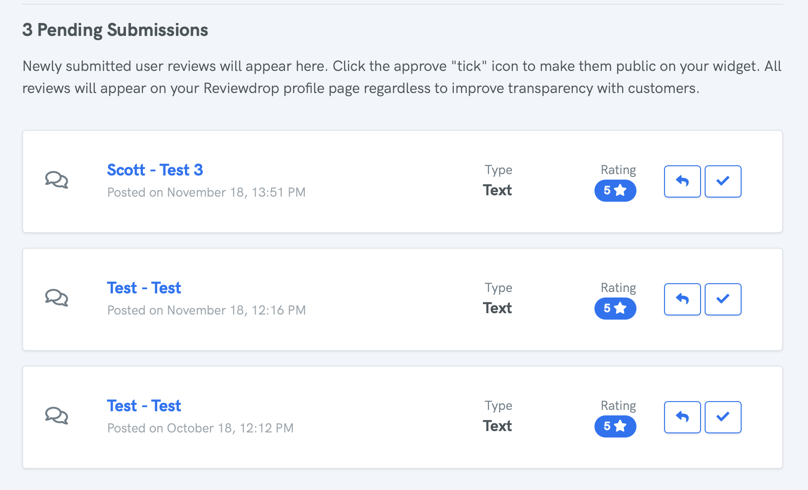

# Pending Submissions

Pending submissions are found under the [User Submissions](https://reviewdrop.io/reviews/submissions) page. Pending submissions are reviews that are submitted via the public form. You can either approve or respond to a review.

### Approving a Review

When clicking the "tick" icon to approve a review, it is sent to the widget. If you decide to remove a review from the widget later on, you can click into the individual review to remove.


Reviews submitted from the public "Write a review" page will always appear on your profile.


### Respond to a Review

You can respond to any publicly submitted review to provide feedback on either a positive or  negative review.

