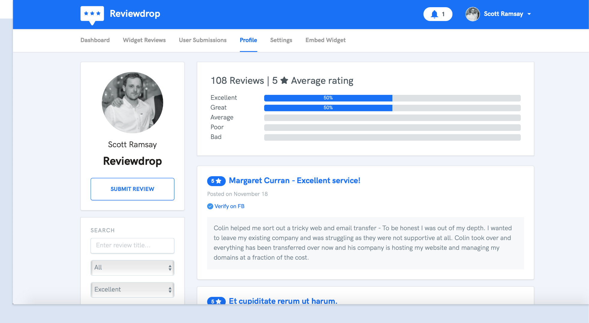
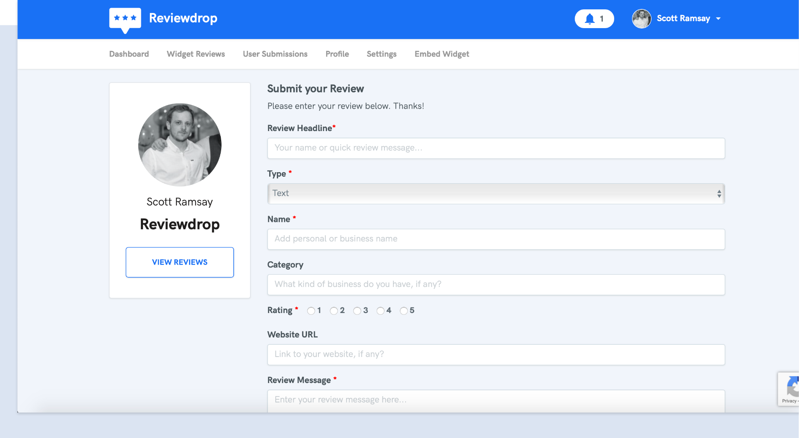

# What is Reviewdrop?

## How does it work?

Reviewdrop has two main tiers. The first \(**Standard**\) - allows you to add manual submitted reviews to your website via an embedded widget. This is aimed for smaller businesses that just need reviews added to their site in a neat and easy to update area on their website. The second tier \(**Pro**\) - allows you to gather review submissions and offer incentives via coupon codes after a user enters a review. 


Reviews submitted by a customer can **never** be manipulated or deleted by the owner account. This is to help keep reviews transparent for the next visitor checking out their reviews.


## On your website

A review widget appears on the corner of your website. Visitors can view your best reviews. These can be entered manually on the standard plan or approved via customer submissions on the pro plan.  


Only approved reviews by the owner will appear on the widget.


## Your Reviewdrop profile

The profile page acts as a hub for detailing the true picture of your business. We value customer transparency - meaning reviews entered via this page by customers cannot be edited or deleted. If you suspect a review may be fake, please get in [touch](https://reviewdrop.io/contact)!


Only customer submitted reviews appear on your profile. You cannot edit/delete customer reviews to improve customer transparency. You can however respond to messages.


## Customer Submissions

When a customer enters a review from the submission page, it will automatically appear on your profile page. As mentioned, you cannot edit/delete these reviews to give visitors a true reflection of your service.

We believe that to improve transparency you should not get upset with bad reviews, but respond in a professional manner. With our "Response" feature, you can add a reply to any review to give your thoughts on the matter.

### Customer Incentives

When a customer submits a review, you have ability to show them a coupon code and a thank you message. This should help increase reviews and conversion with their next purchase.

