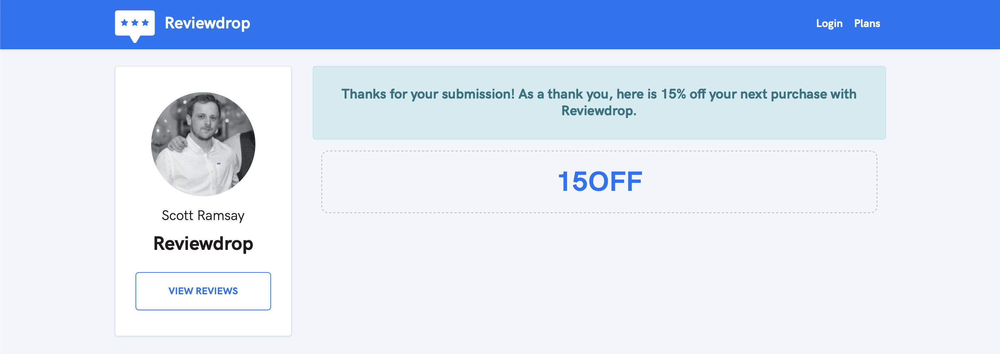

# What is Reviewdrop?

## How does it work?

Reviewdrop is an all in one solution to gather reviews and display them on either your website widget or company profile page. Review types consist of Text, Image, Video, Twitter and Instagram posts.

## On your website

A review widget appears on the corner of your website. Visitors can view your best reviews or click the button to view all and submit their own.


Only approved reviews by the owner will appear on the widget.


## Your Reviewdrop profile

The profile page acts as a hub for detailing a true picture of your business.

## Customer Submissions

When a customer enters a review from the submission page, it will automatically appear on your profile page. You also have ability to either respond or approve on your website widget.

### Customer Incentives

When a customer submits a review, you have ability to show them a coupon code and a thank you message. This should help increase reviews and conversion with their next purchase.

